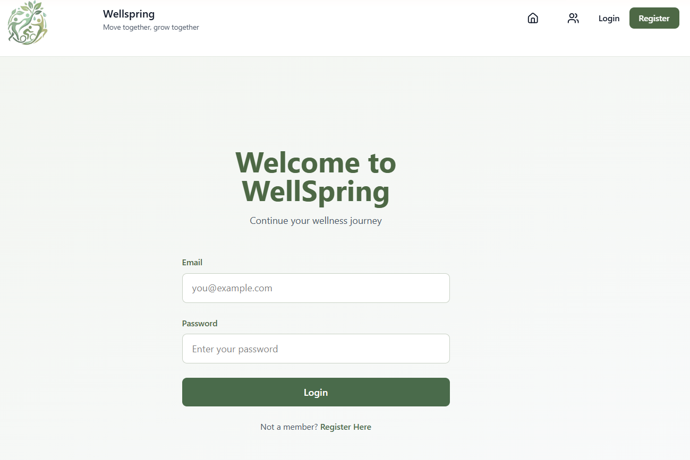
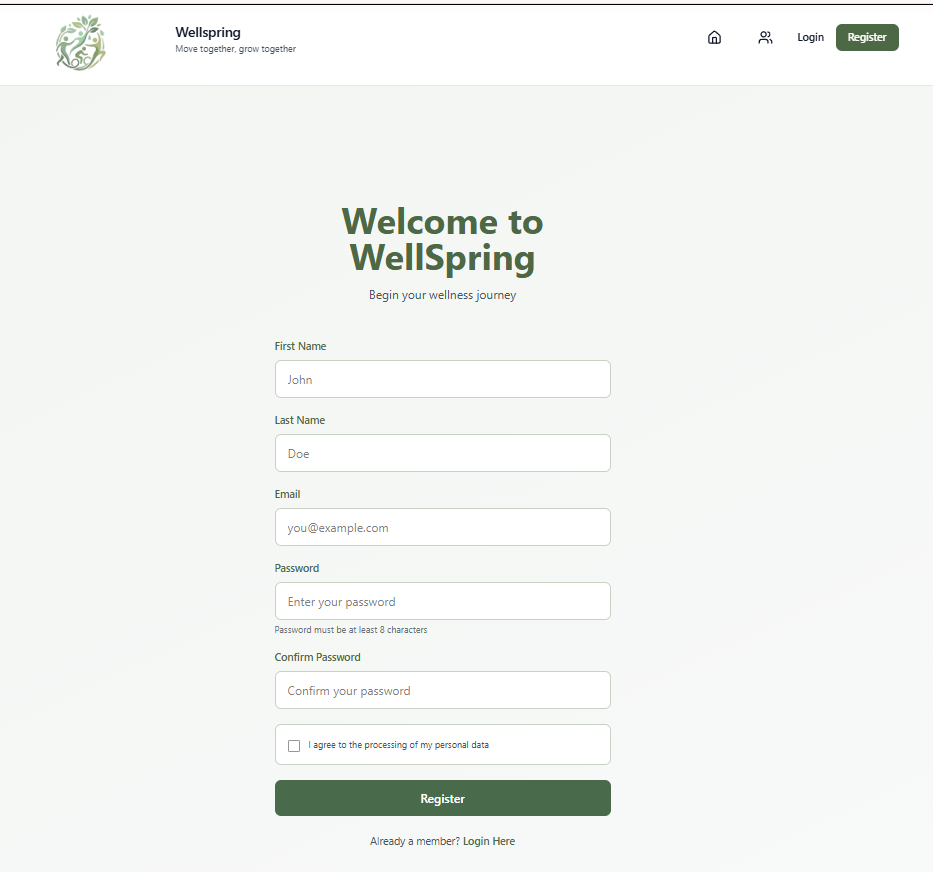
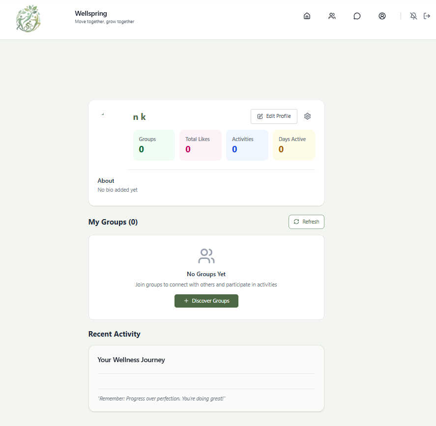
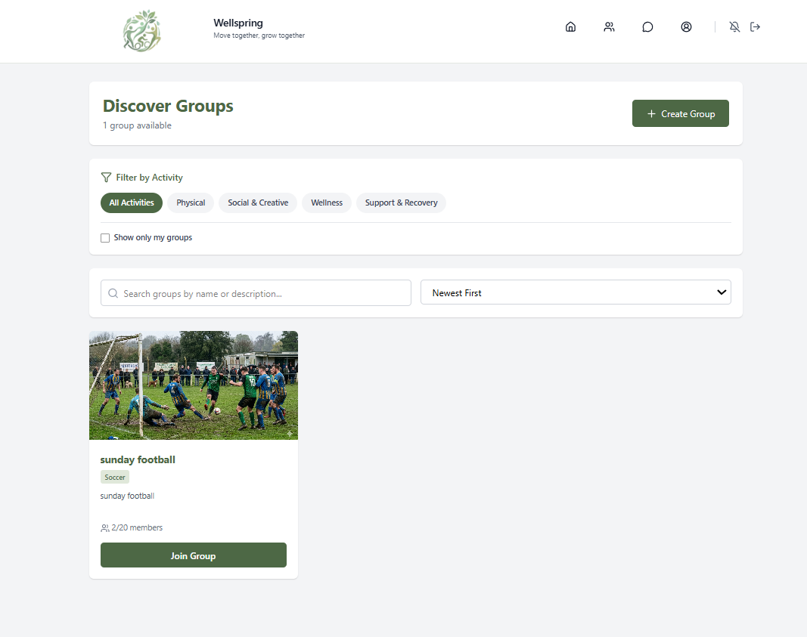
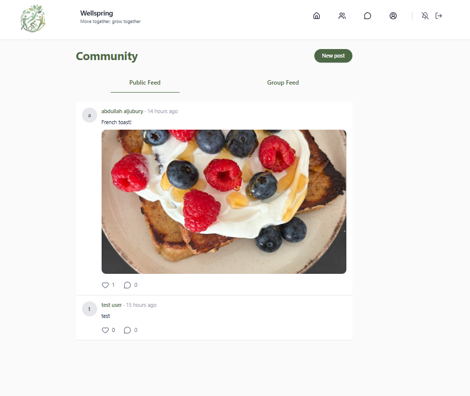
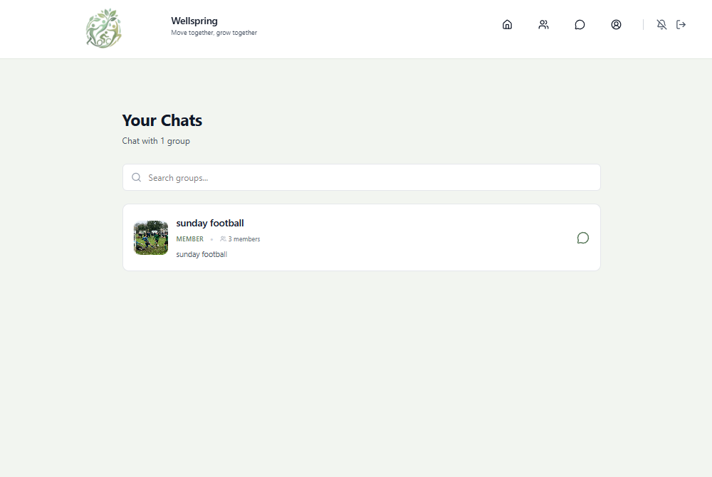
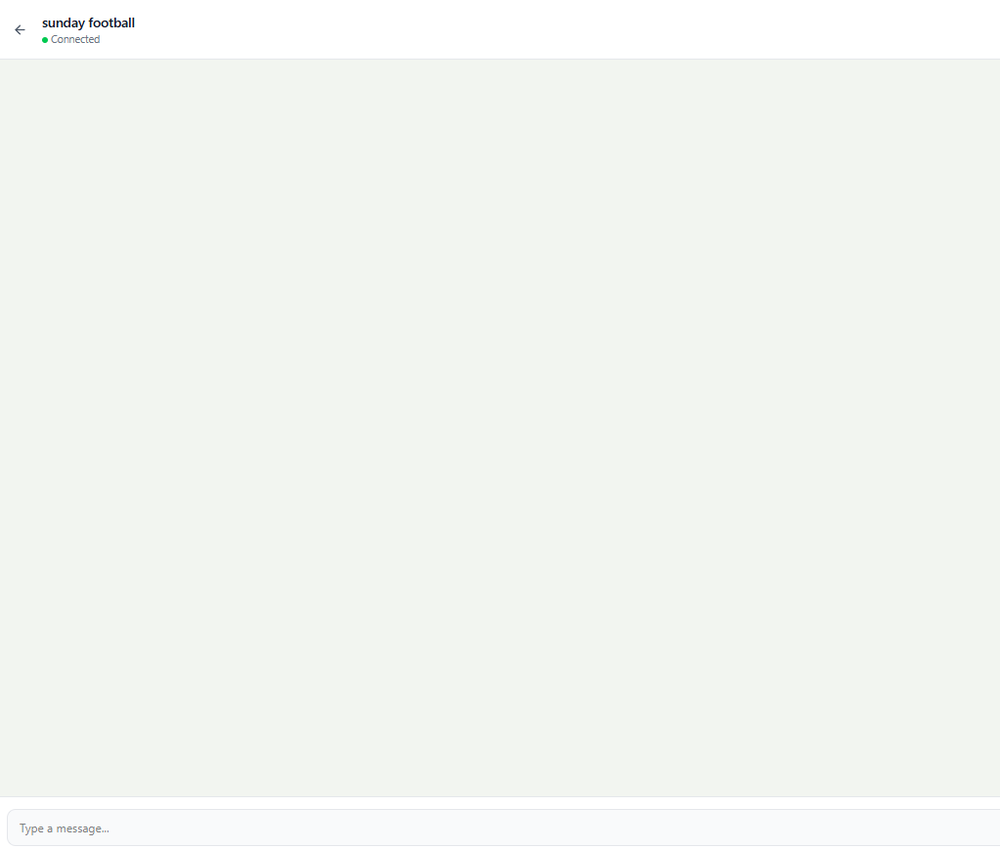

Wellbeing & Small-Group Community App

Kuvakaappaukset:
Login:

Register:

Profile:

Groups:

Community:

Chat:

Linkki sivuun: https://wellspring-ws.netlify.app

Testi käyttäjän tunnukset:
admin@user.com
Salasana: 123456789

Linkki Api-dokumentaatioon:

Wireframe:
https://park-rabid-40787467.figma.site

Tietokannan kuvaus:
PostgreSQL
Prisma ORM

Modelit
-User
-Group
-Membership
-Post
-Comment
-Event
-EventParticipant
-RefreshToken
-AuditLog

Relaatiot:
Käyttäjä voi kuulua useaan ryhmään
Ryhmällä on useita käyttäjiä
Julkaisulla voi olla kommentteja
Tapahtumat liittyvät ryhmiin ja käyttäjiin

Toiminnallisuudet:
Käyttäjä
-Rekisteröityminen
-Sisäänkirjautuminen 
-Uloskirjautuminen
-Profiilin-muokkaus(Nimi, About me ja Kuva)

Ryhmä
-Ryhmän luominen
-Ryhmään liittyminen
-Julkaisun tekeminen
-Ryhmä-chatti

Julkaisut
-Julkaisun luonti
-Kommentointi
-Tykkäys

Bugit/Ongelmat:
*Kommenttien määrä näkyy väärin, vaikka kommentti olisi poistettu.
*Ryhmän liittymisen jälkeen sivun päivitys voi perua jäsenyyden ryhmäsivulla, mutta chatti jää näkyviin.
*Profiili-sivun tilastoista osa ei päivity oikein.
*Recent activity ei näytä kaikkia tageja oikein
*Julkaisujen määrää ei ole rajoitettu syötteissä

Käytetyt Materiaalit (Nasteho):
Community-sivu/ShareModal
Reactin emoji-picker-react kirjasto
Reactin timeago kirjasto
https://uibakery.io/crud-operations/react
https://choubey.gitbook.io/react-coding-puzzles/39-comment-section-with-nested-replies
https://www.youtube.com/watch?v=tp7KLHA9ci8&t=1946s

Protectedroutes: https://github.com/ilkkamtk/hybridisovellukset/blob/main/Week3/context.md

Profiili:
https://www.youtube.com/watch?v=pWd6Enu2Pjs
https://www.youtube.com/watch?v=Frtvnb4gaHs

Login/Register:
https://github.com/ilkkamtk/hybridisovellukset/blob/main/Week3/forms.md
https://www.youtube.com/watch?v=F53MPHqOmYI&t=944s

Testaus materiaalit:
https://michaelrevans.me/blog/creating-a-modal-in-react
https://medium.com/@entekumejeffrey/part-6-testing-asynchronous-code-and-api-calls-with-jest-and-react-testing-library-5608dc97cf5a
https://medium.com/@entekumejeffrey/
part-8-testing-forms-and-user-inputs-in-react-with-jest-a879fa799bbc

Ai:n käyttö:
Delete näppäin dropdown
Container tyylitysten korjaus
public/group feed reititysten korjaus
tykkäyksien optimistinen ui
dynaaminen endpoint valinta
debuggaus

Testaukset:
**Login, rekisteri ja Community-sivujen vierestä
---------------------------------------------------------------